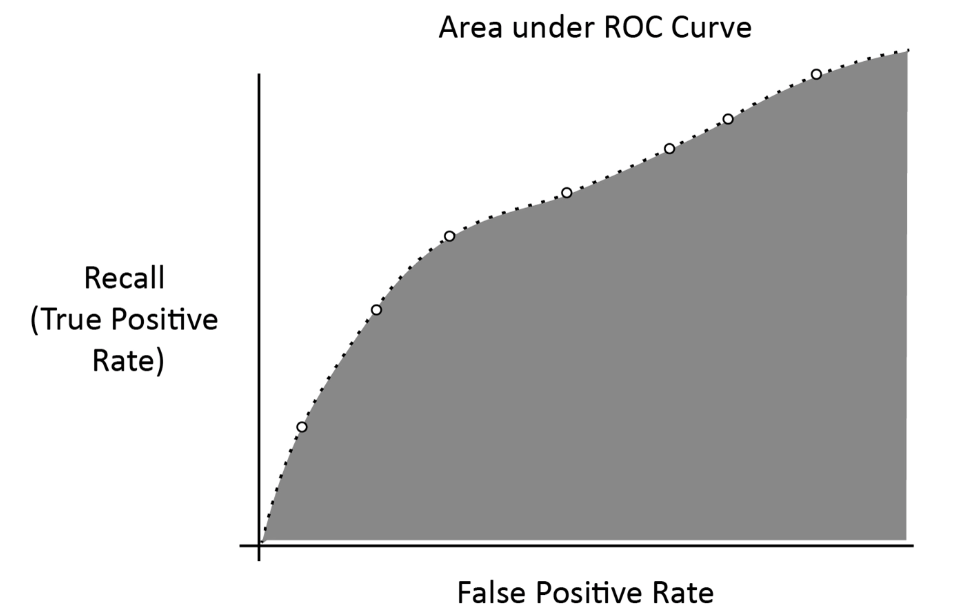

# Evaluating Models

* Context matters
* Efficiency definitely matters
* Measure our prediction with ideal prediction
* Take priority over speed optimizations

## Continuous

* Example - Total sales, stock price and temperature

### Errors

* General idea
  * How far off we were from the predicted value
* Attend all error values individualy - not feasible or practival
* Dealing with large data
  * There could be million or more of these error values

#### Errors in Aggregate

* Mean Squared Error (MSE)
* Mean Absolute Error (MAE)

##### [MSE](https://en.wikipedia.org/wiki/Mean_squared_error) and [MAE](https://en.wikipedia.org/wiki/Mean_absolute_error)

* Give us good overall picture of predicitons
* MSE takes the squares of the errors
* Large error values are emphasized more
* MAE maintains same units
* Directly comparable to the values

##### [R-Squared](https://en.wikipedia.org/wiki/Coefficient_of_determination)

* Alternatively called R(superscript 2) or R2
* Coefficient of determination
  * Used as evaluation metric for continuous variable modesl
* Gives us general idea about deviations of predictions
* Measures proportion of variance in observed values
* Attempt to create a model and predict variability in observed values

## Categorical

* Predict descrete value
* Examples 
  * Fraud/not fraud
  * Activity
    * Standing
    * Sitting
    * Walking
  * Approved/not approved

### Individual Evaluation Metrics

* Many ways to evalute discrete predictions with metrics
* No one-size-fits-all metric for evaluation in continuous variables
* Need to determine metric that fits the problem
* Not to optimize for wrong things and then waste time
* Provide complete representation of model performance
* Techniques
  * Confusion matrices
  * AUC - Area Under the Curve
  * ROC - Reciever Operating Characteristic

#### Types of Individual Evaluation Metrics

* Accuracy
* Precision
* Recall
* Specificity
* Sensitivity
* Fallout
* False Omission Rate

#### Scenerios of Descreate Observations

* True Positive (TP)
  * Predicted and observed category are same
  * Example - predicted fraud and observation was fraud
* False Positive (FP)
  * Predicted and observed category are not same
  * Example - predicted fraud but observation was not fraud
* True Negative (TN)
  * Predicted certain category, observation was not that category
  * Example - predicted not fraud and observation was not fraud
* False Negative (FN)
  * Predicted certain category, observation was the different category
  * Example - predicted not fraud but observation was fraud

#### Common Metrics

* Accuracy
  * Percentage of predictions that were right
  * ( TP + TN )/( TP + TN + FP + FN )
* Precision
  * Percentage of positive predictions
  * TP/( TP + FP )
* Recall
  * Precentage of identified positive predictions
  * TP/( TP + FN )

#### [Confusion Matrix](https://en.wikipedia.org/wiki/Confusion_matrix)

* Allows to visualize the various TP, TN, FP, and FN values
* Rows corresponding to the categories that were supposed to predict
* Columns corresponding to predicted categories
* Values of each element is corresponding count

#### [ROC Curves](https://en.wikipedia.org/wiki/Receiver_operating_characteristic)

* Get overall picture of performance of binary classifiers
* Plot the recall versus false positive rate
* Threshold represent various boundaries or rankings
* Make a prediction for the two classes based
  * Probability
  * Ranking
  * Score

