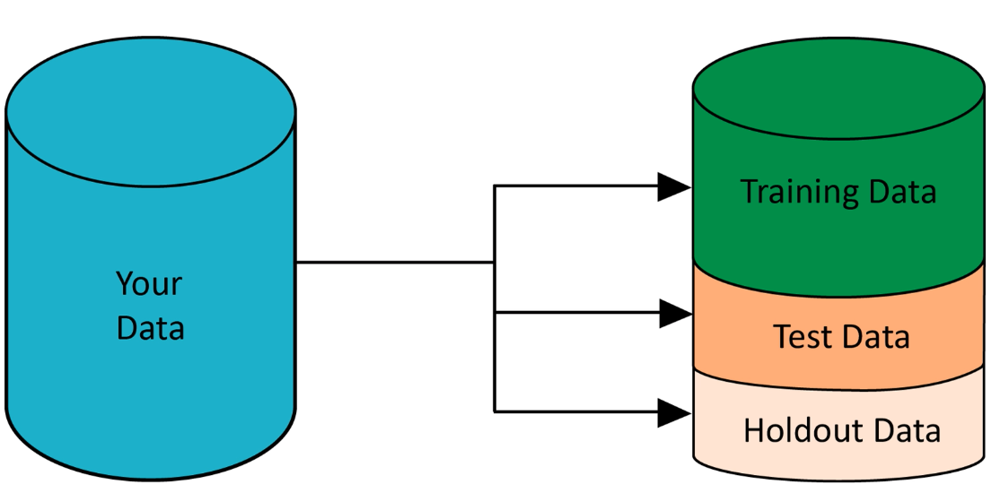
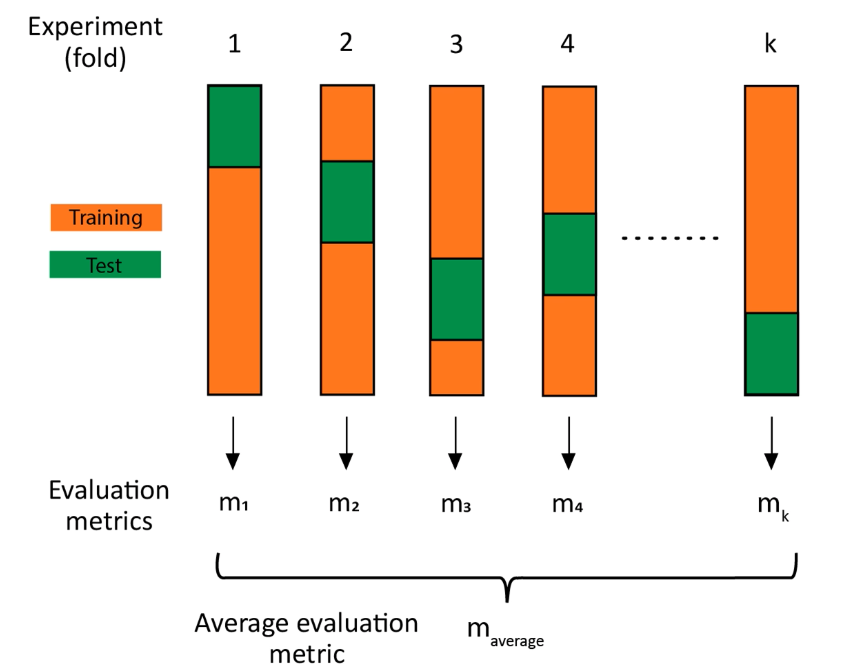

# Validation

## Preventing Overfitting

* Train or fit model on portion of dataset
* Test and evaluate model on different portion of dataset
* Avoid overfitting
  * Use holdout sets and/or cross validation

## Training Models

* Parameterizing one or more functions
* Evalute this trained model
* Do not want to test/evaluate model on the same
* Simulate the scenario in which model view new data

## Training Data and Test Data

* Proportion of test depends on type and amount of data
* Ensuring faily accurate representation
* Reduce variability
* Indicates model lacks predictive power

After training_test/main.go is run
`wc -l *.csv`
    443 diabetes.csv
     89 test.csv
    355 training.csv
    887 total

## Holdout Set

* Must never be used in training or testing
* Reserve this dataset for validation
* Make adjustments to model
* Get acceptable performance on test dataset

### Holdout Set Iteration

* Develop first version of model based on training set
* Test it on test set
* Not satisfied with acquired result
* Loop back to step 1

## Cross Validation

* Also called k fold cross validation
* Perform k random splits of dataset
* Results in an evaluation metric result
* Average these evaluation metrics to get an overall evaluation metric
* Look at the variance in the evaluation metric

### Advantages of Cross Validation

* Use entire dataset
* Expose model to training and testing examples
* Already written convenience functions and packaging
* Prevent biases that may resul from choosing a single validation set
