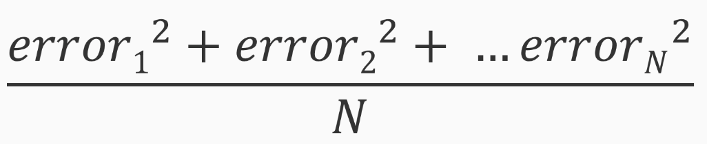

# Linear Regression

* Most simple machine learning models
* Interpretable
* Provide a safe a productive option for data scientists
* Consider and try linear regression to predict a continuous variable

## y = __mx__ + __b__

### Ordinary Least Squares (OLS)

* Use to determine __m__ and __b__
* pick a value for __m__ and __b__
* Measure vertical distance
* Distances - errors or residuals

### Linear Regression Assumptions

* Similar to machine learning models
  * It does not work in all situations
  * Make certain assumptions about data and its relationships

#### Assumptions

* Linear relationship
* Normality
* No multicollinearity
* No auto-correlations
* Homoscedasticity

#### Pitfalls

* Carefull make predictions for values outside range
* Cam misspecify a linear regression model
* Regression line for certain types of fitting, such as OLS

#### Profiling the Data

* Create a model
* Mentally check our results
* Start every process with data profiling
  * Understand
  * Distribution
  * Range
  * Variability

##### Alternates

* Use a statistical tool - quantile-quantile (q-q) plot
* Ascertain close the distributions are to normal distributions
* Perfom a statistical test to calculate probability of variables
* Historgram provides general idea

#### Decision Making

* Visually exploring the correlations
* Dependent variable and all choices
* make scatter plots

