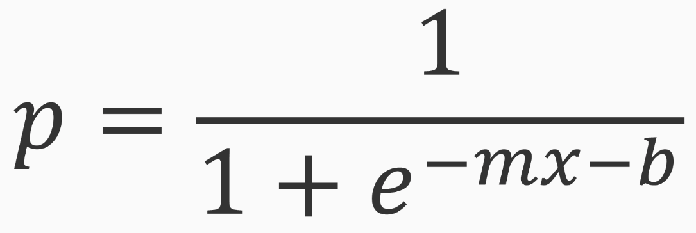

# [Logistic Regression](https://en.wikipedia.org/wiki/Logistic_regression)

* Based on a regression
* Uses a funciton well suited to classification problems
* A simple and interpretable model
* Great first choice when solving classification problems

# Modeling p

* Model log of odds ratio

What does this tell?

Pressence or absence of class A has effect on presence or absence of class B

## Classification Terms

* Categories, labels, or classes
  * Binary classification
  * Multi-class classification
  * Labeled data or annotated data