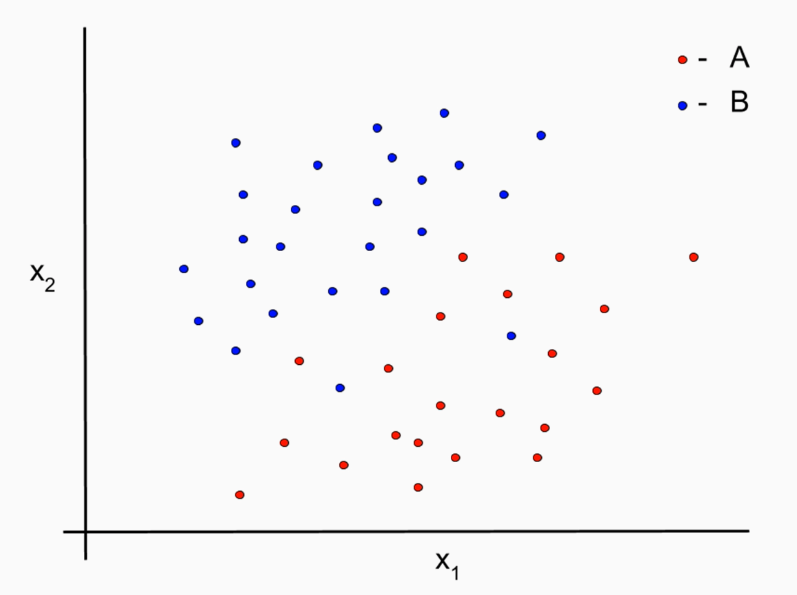

# [k-Neareast Neighbors](https://en.wikipedia.org/wiki/K-nearest_neighbors_algorithm)

* Easiest model algorithms to grasp
* Consider other similar records
* Implemented in multiple existing go packages
* Operates on the principle
  * Classify records according to similar records
  * Does not have the complexity of parameters and options

## Process

* Find the __k__ nearest point to the new point
* Determine number of __k__ nearest neighbors are of class A and B
* Classify the new point as the dominant class