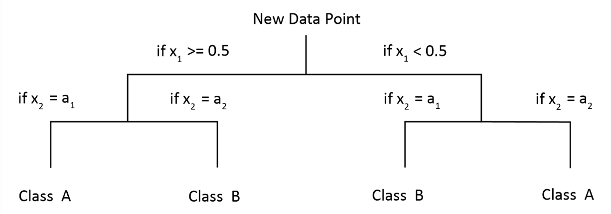

# [Decision Trees](https://en.wikipedia.org/wiki/Decision_tree)

* Widely utilized and very powerful
* Series of __if-then__ statements applied to data
* Construct series of control flow statements
* Allow you to classify records

## Ways to Choose

* Entropy - quantity used to determine constructions
* Based on most informative features
* Prioritizing important features higher on tree
