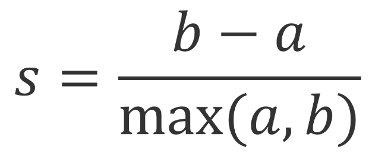

# Understanding Clustering

## Clustering

* Own set of terms
* Define and utilize some distance or similarity
* Directly influencesx how the clusters are generated
* The Euclidean distance or the squared Euclidean distance
  * Straight line distance between two data points

### Internal Clustering Evaluation

* Stuck with evaluating how well our clustering technique performs
* Evaluate clustering by making similarity and dissimilarity measurements
* The [silhouette coefficient](https://en.wikipedia.org/wiki/Silhouette_(clustering))

