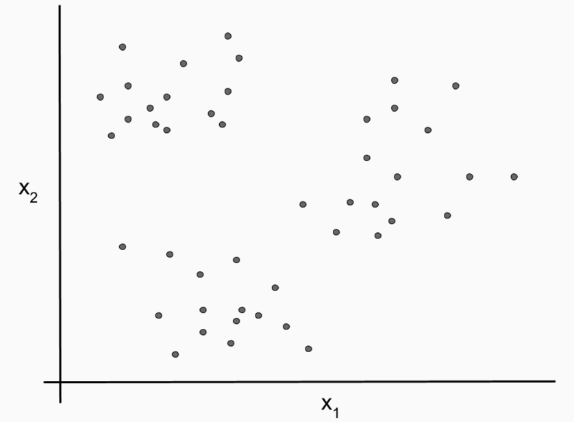
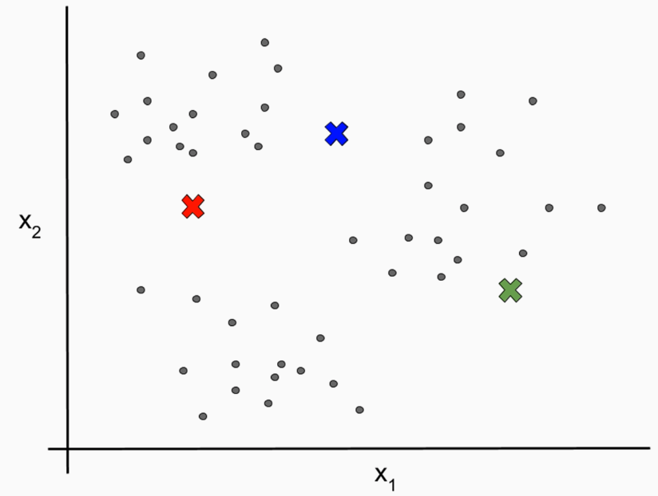

# [k-mean Clustering]

* Iterative method
* Data points are clustered around cluster centroids
* Adjusted during each iteration

## Requirements

* Choose how many clusters will results from clustering
* Parameter k - gives k-means its name
* Randomly choose x1 and x2 locations of k centroids
* Serve as our starting point for the algorithm

### Steps

* Assign each data point corresponding to the nearest centroid
* Calculate the mean x1 and x2 locations within each cluster
* Update each centroid's location to calculated x1 and x2 locations

[k-mean Clustering]: https://en.wikipedia.org/wiki/K-means_clustering