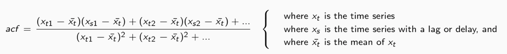
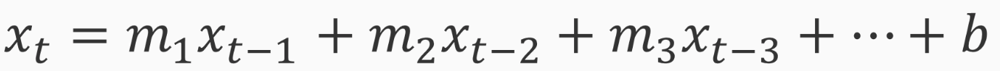
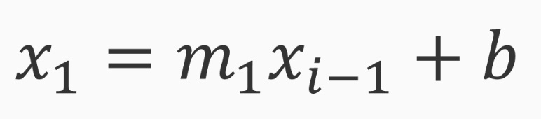
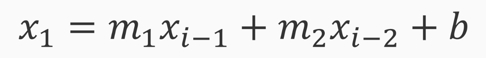

# [Time Series] Data

[Time Series]: https://en.wikipedia.org/wiki/Time_series

## Why Statistics

* Help us as we profile data
* Gaining intuition about the behavior of your time series over
* Time, seasonality, and trends
* Apply approriate modesl and perform mental checks of you results

### [Autocorrelation](https://en.wikipedia.org/wiki/Autocorrelation)

* Measure of how correlated signal is with delayed version
* Utilize the autocorreclation funciton (ACF)

### [Partial Autocorrelation](https://en.wikipedia.org/wiki/Partial_autocorrelation_function)

* Related to autocorrelation
* Some subtle differences
* A conditional sort of correlation
* Measures the correlation of a series with itself
* Leftover autocorrelation after intermediate correlations

## [Auto Regressive Model](https://en.wikipedia.org/wiki/Autoregressive_model) Overview

* Referred as AR(1), AR(2), and so on
* Correspond to the order of the AR model
* Determine by performing
* Autocorrelation
* Partial autocorrelation analysis

### AR(1) Model

### AR(2) Model

### Main Assumptions

* Stationarity
  * Not see any trends in the data if we plan on using AR models
* Ergodicity
  * The statistical properties, should not vary or drift over time