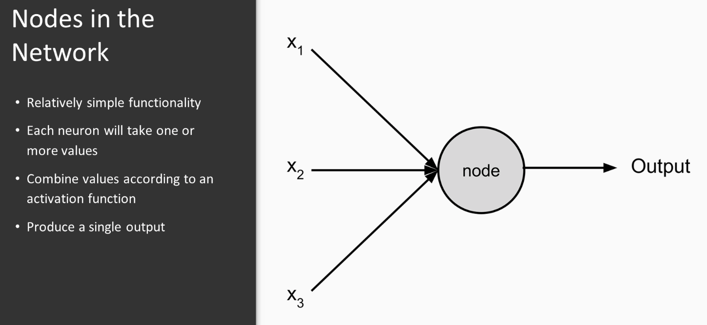
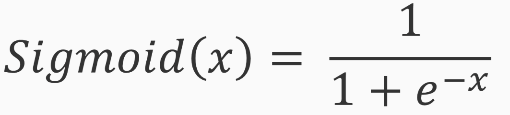
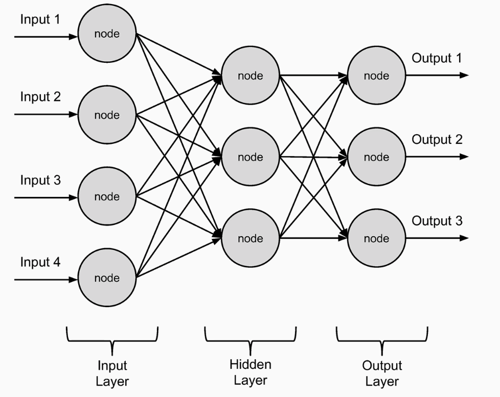

# Neural Networks

## How to Combine Input

* Need a method to combine inputs
  * This is adjustable
  * Comnbining variables is one trainable way to combine inputs
* Combine the inputs linearly
  * Some coefficients (weights)
  * Intercept (the bias)

Still the above is very linear

### Introduce Non-Linearity

* Apply activation function
* Similar to logistic function
* Referred as the [sigmoid function](https://en.wikipedia.org/wiki/Sigmoid_function)

## Simple Neural Network

* Conains
  * An input and output layer
  * Single hidden layer between the input and output layer

### Why one hidden layer?

* One layer is sufficent for large majority of simple tasks
* Search number of nodes in hidden layer

### [Backpropagation](https://en.wikipedia.org/wiki/Backpropagation)

* Method for training neural network that:
  * Feeding training data forward
  * Calculating errors in the output
  * Using gradient descent
  * Backpropagating wieght/bias changes into the network